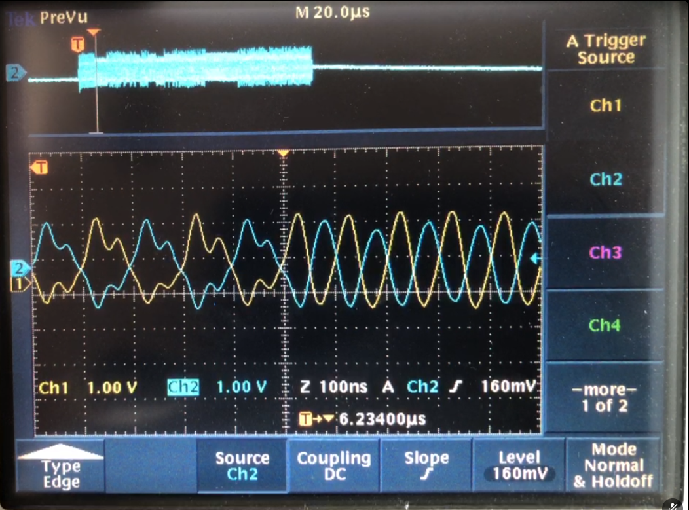

## 2EAI-SoC-2022-ETHERNET ANALYSING ⚡

# Our project

- **Introduction**

Our project consist of anylysing an internet connection with the Pynq-z1. The main purpose is the catch an ethernet package and anylyse it. We make use of clocks and bits (0 and 1).

- **Ethernet Test**

  [More info...](Ethernet_test)

- **Images**

  [More info...](photos)

- **Python code for sending**

  [More info...](https://github.com/Bram-Vanderwegen/SoC_project/tree/main/python%20code%20for%20sending)

# First data

With this picture we can analyse where the differences are and how the signal transfers the bits over the ethernet. We can also look for triggers and focus points for analyzing purposes.

# Our Team 

- **Ivan Groffils** - _CONTRIBUTOR_ - [Ivan Groffils](https://github.com/ivangroffils)
- **Bram Vanderwegen** - _CONTRIBUTOR_ - [Bram Vanderwegen](https://github.com/Bram-Vanderwegen/)

- **Vincent Claes** - _TEACHER_ - [Vincent Claes](https://github.com/cteqeu)

 

## Questions

For questions and support please submit an issue or contact us.
[Contact Ivan](mailto:ivan.groffils@student.pxl.be)
[Contact Bram](mailto:bram.vanderwegen@student.pxl.be)

